# Assignment 1 

Name: Abdrakhmanova Aruzhan  
Group: IT-2501

## Content
- Part 1: Numbers(4 tasks)
- Part 2: Sequences(3 tasks)
- Part 3: Strings(3 tasks)

# Output Examples
- ## 1st part
- task 1 

we need to take number and print each digit on a new line using recursion. 
first we check if this number is digit
`if (n < 10) {
System.out.println(n);
return;`
if the number has only one digit then we just return n.
each digit represents a power of 10. I putted 10 to get every number from the last to first.
then we 
`n/10` that removes the last digit and reduce the number step by step. `n%10` represents 
the last digit after n/10. 
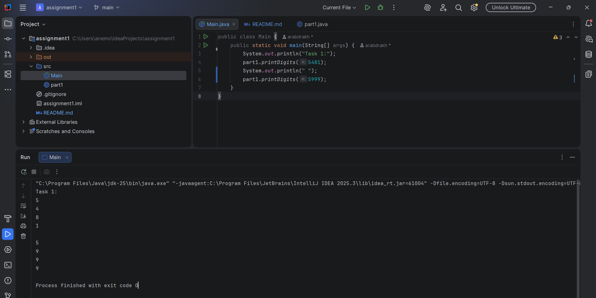
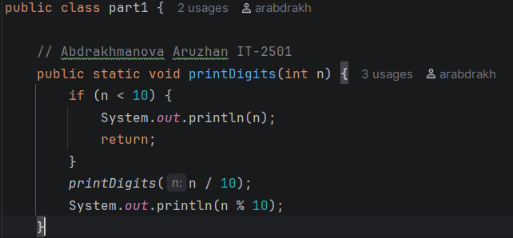
- task 2

function sum calculates the average sum of all elements in an array. it recursively adds the last element of the array to the sum of the remaining 
element until it reaches `n==0`. and in main it calculates the average of array using recursion. i created an array `int[] arr = {3, 2, 4, 1};`, then call 
recursive function to calculate the sum of elements and used length command to take the number of elements. and then using System.out.println i calculated 
and printed the result. (double) sum/ arr.length. double to save decimal part.5
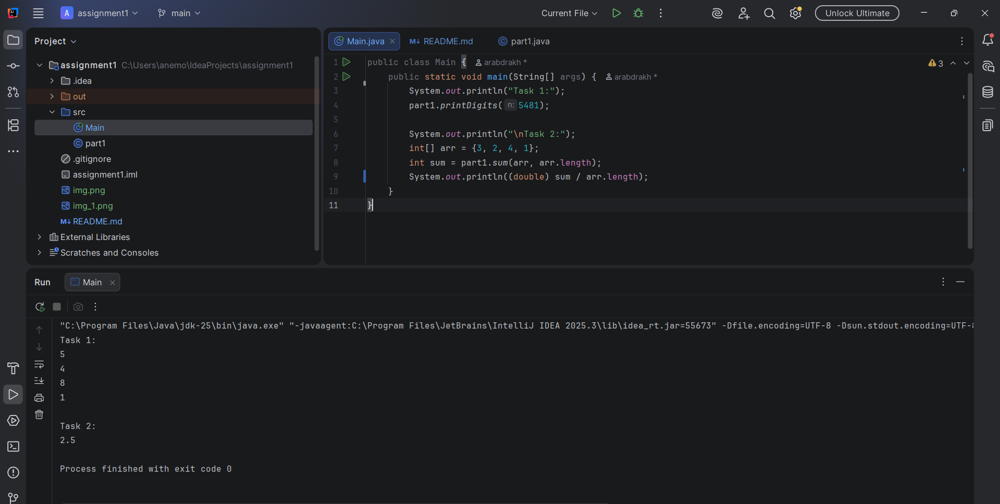
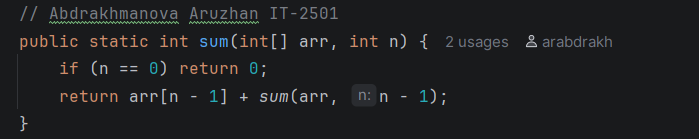

- task 3

this task checks whether a number is prime or not using recursion. in main i used ternary operator System.out.println(part1.isPrime(7, 2) ? "Prime" : "Composite"); 
that print Prime if true and vice versa. in function isPrime int i is the current divisor. base case: n<=2. 2 and 1 are prime and numbers less than 1 are not prime. 
`if (n % i == 0) return false;` so if number is divisible to i (in main initial i=2) then it is not prime. another base case `if (i * i > n) return true;` making i*i we checked 
up to sqrt n and found no divisors and this is prime. by return `isPrime(n, i+1)` we use recursion and check if it is prime starting with 2. if no divisor before 2nd base case
the number is prime.
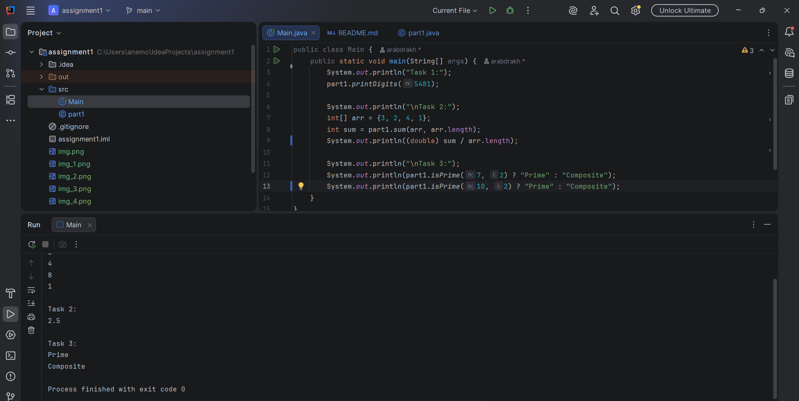
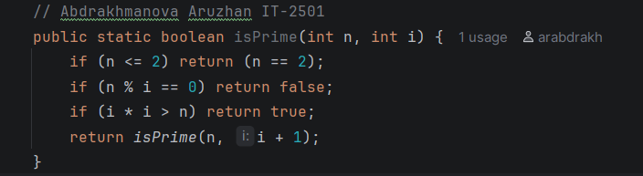

- task 4

this function factorial calculayes the factorial of a number recursively. `public static long factorial(int n) {` return long to hold bigger numbers than int up to 20!. base case 
`if (n == 0) return 1;` because factorial of 0 and 1 = 1. `return n * factorial(n - 1);` call itself with n-1 reducing by one each line and multiplies the result by n and continues 
until n == 0.
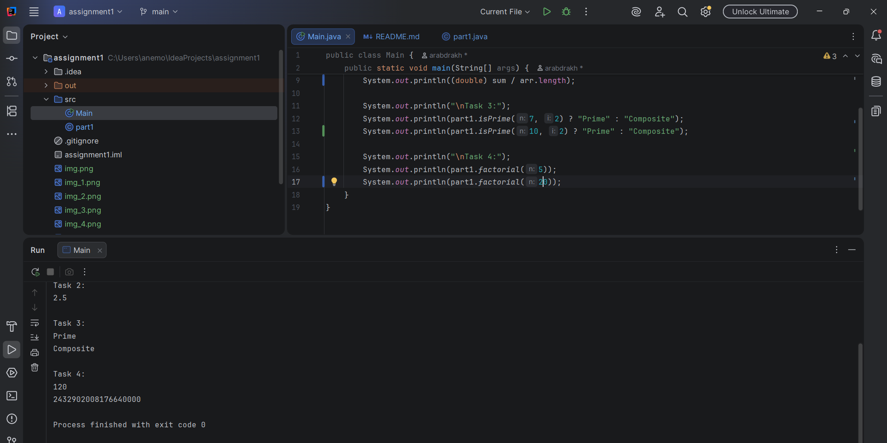
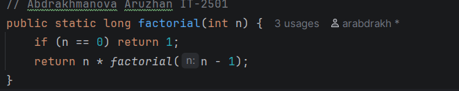

- ## 2nd part
- task 5

function fib calculates the n-th fibonacci number recursively. `public static int fib(int n) {` method 
fib takes an integer n and returns the n-th fibonacci number. base cases `if (n == 0) return 0;` and 
`if (n == 1) return 1;` because by definition of fibonacci F0=0 and F1=1. recursive will never stop if we will 
not return a fixed number instead of callinf fib again and again. `return fib(n - 1) + fib(n - 2);` in fibonacci 
it calls itself for the 2 prev numbers and adds them together until n==1(base case).

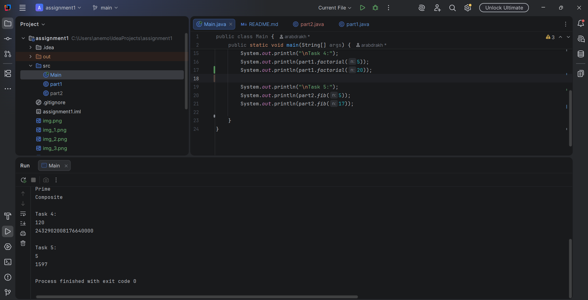
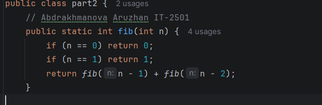

- task 6

function power calculates a to the power of n using recursion. `public static int power(int a, int n) {` method power takes the base a, the exponent n. base case 
`if (n == 0) return 1;` because any number with exponent 0 is 1, no need in recursion. `return a * power(a, n - 1);` recursion. multiply the base a to the power(a, n-1) 
until n=0. in main `System.out.println(part2.power(2, 10));` calls power and multiplies 2 10 times until n=0
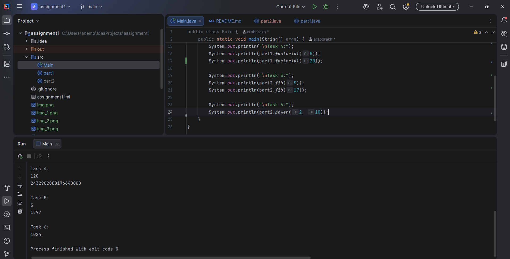
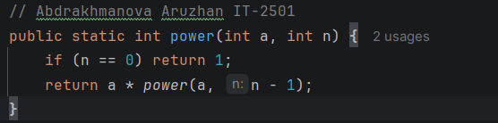

- task 7

function reverse prints an array in reverse order using recursion. `public static void reverse(int[] arr, int n) {` method reverse takes arr and n. base case `if (n == 0) return;` 
when n==0 there are no elements left to print, no need in recursion. `System.out.print(arr[n - 1] + " ");` for printing the last element before the recursive call. `reverse(arr, n - 1);`  
recursive call to reduce until base case. it is kind of similiar(print before recurive call) to the code from the first lesson
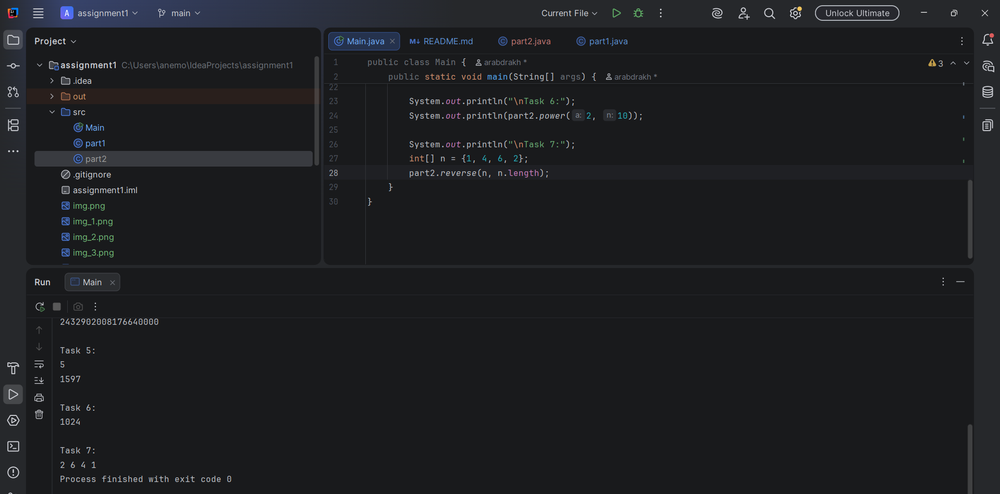
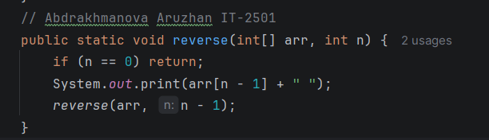

- ## 3rd part
- task 8

function digits checks recursively if a string contains only digits using boolean true/false. `public static boolean digits(String s, int i) {` contains the string s and index in the string i.
base case `if (i == s.length()) return true;` if we reached the end then all characgters were digits and it returns true. another base case `if (!Character.isDigit(s.charAt(i))) return false;`
if current character is not digit then it returns false. Character.isDigit() is a built in java method that checks wheter a character is a digit. s.charAt(i) takes string s and gives the current character 
at position index i.
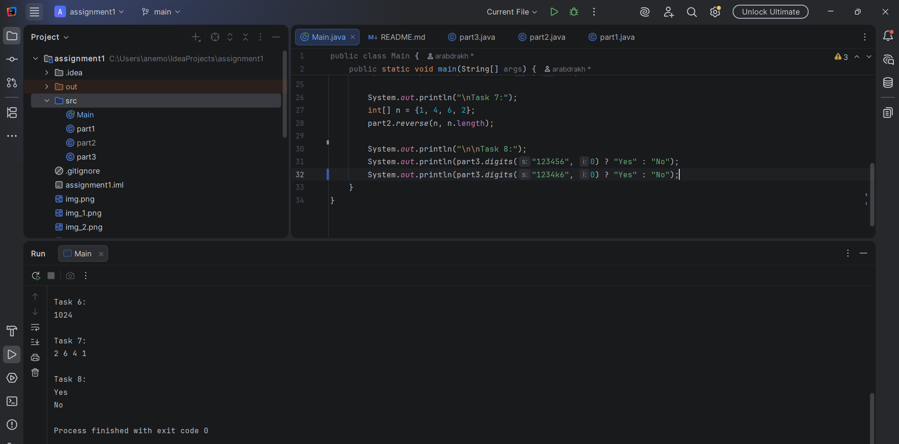
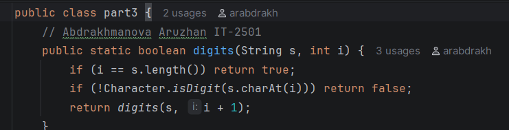

- task 9

gunction countchars counts the number of characters in a string recursively. `public static int countchars(String s) {` function takes a string s and returns number of chars. base case `if (s.equals("")) return 0;` 
if the string is empty it returns 0, no need in recursion. `return 1 + countchars(s.substring(1));` recursion where `s.substring(1)` gets the string without the first character and add 1 to the first character. repeats 
until string is empty. like hello--1+ello--1+1+llo--... moving through the string one char at a time
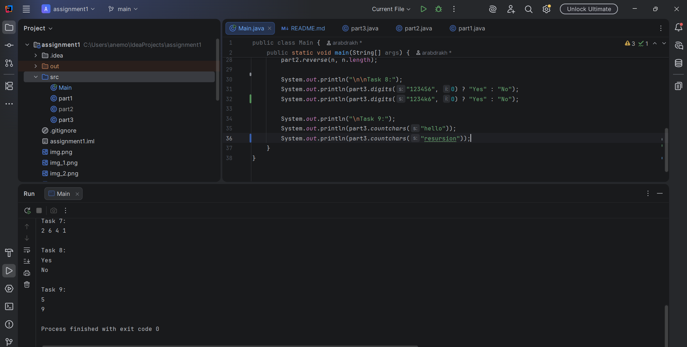
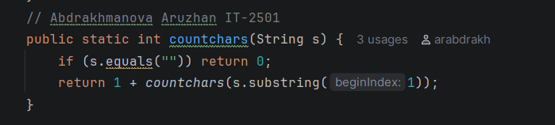

- task 10

function gcd finds the greates common divisor of two nums using recursion. `public static int gcd(int a, int b) {` function takes two ints a and b. base case `if (b == 0) return a;` if the 2nd num b is 0 it returns a because 
gcd = a. `return gcd(b, a % b);` recursively calls gcd, a%b is the remainder when a is divided by b until base case. for example, we have a=48 and b=32. 48%32 = 16. then a = 32 and b=16. 32%16=0 so gcd = a and a =16. or another 
example gcd(10, 5), 10%5 = 0.  so it will be (5, 0). gcd = a. a=5
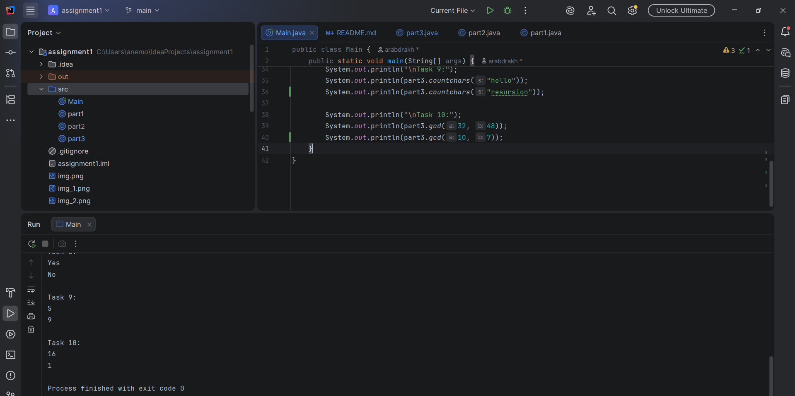
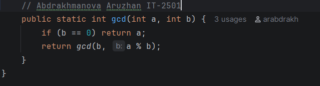
## Summary
In this assignment i practiced recursion:
- base cases
- recursive calls
- working with arrays, numbers, and strings
- mathematical concepts

the most challenging parts for me were working with strings recursively like checking digits and counting characters and understanding the fibonacci recursion, because I had to carefully think about the base cases and how the function calls itself. 
i used knowledge from courses i learnt before(oop, programming in school, some skills from learning go language) to do these tasks so a lot of things were easy except syntax of java
